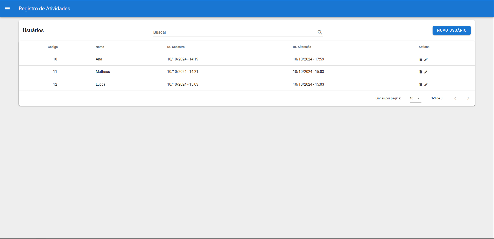
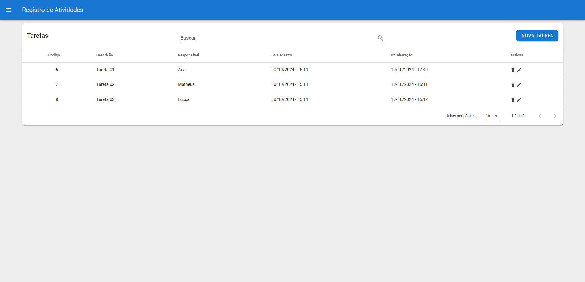
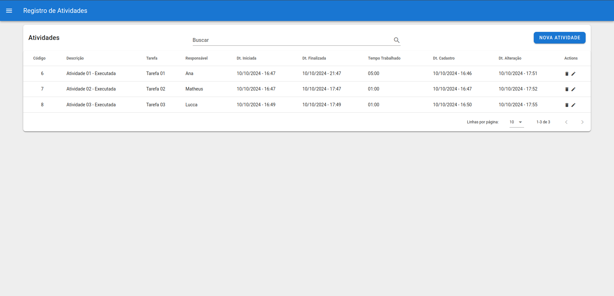
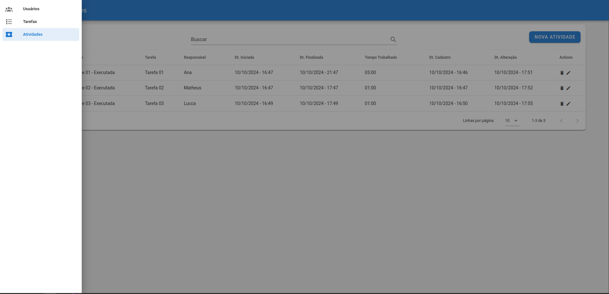

# Gestão UI

Ui para consumir a api de registro de tarefas e horas trabalhadas

## Sobre o sistema
- Usuários: podem ser vinculados como responsável nas tarefas.
- Tarefas: tem a ideia de uma solicitação, para ser executada.
- Atividades: Tem o objetivo de registrar as horas trabalhadas de cada usuário em cima de uma tarefa.

## Requisitos
- node 18.20.2
- npm 10.5.0

## Uso
```bash
# Instalar as dependêcias
npm install

# Iniciar ui
npm run serve

# Compilar ui
npm run build
```

## Telas

Crud de Usuários


Crud de Tarefas


Crud de Atividades


Menu Lateral

